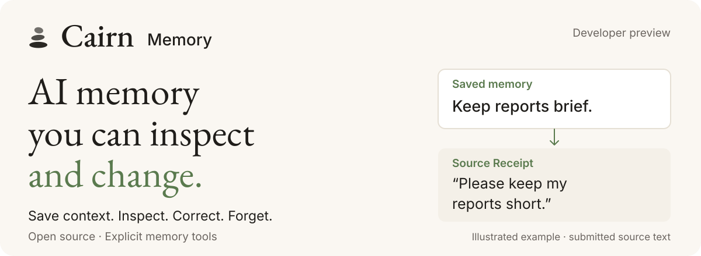
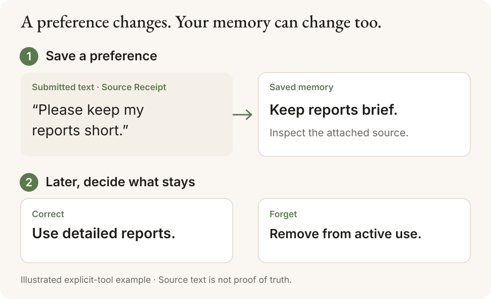

  

# Cairn Memory

[English README](README.md) · **繁體中文**

**保存跨次 AI 工作的重要背景，需求改變時也能修改。**

你是不是常跟 AI 重複說：「報告要簡短」「這個專案已經改方向了」？
Cairn 提供工具，讓你把這些偏好或決定存成記憶，下次可以查看；事情改變時，
也能修改或移出使用中的記憶。

**目前是需要設定的開發者預覽版。** 下方提供日常使用範例、本機安裝與託管
連線入口。

## 一個日常例子

1. 你用記憶工具存下：「我的報告請簡短一點。」
2. 開新一段對話時，你可以透過已接好的記憶工具查看這個偏好，以及當初存入的文字。
3. 後來你需要詳細報告，就先查看目前版本，再把偏好改成「報告請寫詳細一點」。
4. 如果這個偏好已經不適用，也可以把它移出使用中的記憶。

圖片是概念示意，並非 Claude、Codex 或產品介面的截圖。本機預覽版預設靠明確
呼叫工具來保存記憶，**不會自行讀取你的全部對話**。

## Source Receipt 是什麼？

可以先把它理解成「這筆記憶附上的來源文字」。它保留保存或修改這筆記憶時
提交的文字，方便你對照：**這筆記憶是根據什麼內容存下來的？**

它不能保證記憶正確、完整理解了你的意思，或內容本身是真實的；也不是整段
對話的經過驗證的紀錄。忘記一筆記憶，是把它移出使用中的記憶，不代表硬碟、
來源紀錄和備份都已安全抹除；改寫過的相似內容仍可能被存成新記憶。

## Cairn Memory 與 Cairn

**Cairn Memory** 是這個 repo 提供的開源記憶工具，用來保存、查看與修改 AI
工作的背景。**[Cairn](https://cairn.ink)** 是人與 AI 共用的託管記憶地圖，讓人
整理、審閱與分享知識。

這個 repo 同時包含本機工具與連接 Cairn 託管服務的整合。兩條路徑的設定與
功能範圍分別說明：本機使用不需要 Cairn 帳號；託管連線需要相容的服務與
登入授權。

## 我應該從哪裡開始？

| 你現在想做的事 | 建議入口 | 需要什麼 |
| --- | --- | --- |
| 先看懂用途，不想安裝 | [36 秒操作影片](docs/promotion/demo/cairn-memory-preview.mp4) | 不需要安裝或 Cairn 帳號；影片展示工具輸出 |
| 在自己的電腦試工具 | [英文 README 的本機安裝步驟](README.md#try-the-local-memory-layer) | 需要終端機設定與 Git、Node、npm、tar；安裝驗證目前涵蓋 Linux x64；不需要 Cairn 帳號 |
| 使用已文件化的 Claude Code／Codex 託管連線 | [託管設定](README.md#existing-hosted-integration) | 需要相容的服務與登入授權；Claude Code 外掛需要 Cairn 帳號與 token |

如果你平常只在網頁或桌面 App 聊天，**先不要照著 Claude Code 或 Codex 的
終端機指令安裝**；先確認你使用的是哪個客戶端，以及它支援的連接方式。
目前保留的本機驗證涵蓋 SDK 與指定版本的 Hermes，沒有建立目前 Claude、Codex
或 ChatGPT 本機端的相容性保證。[已驗證的路徑與範圍](docs/promotion-claims.md#supported-paths)

本機安裝需要終端機操作。設定前，請確認電腦系統、客戶端與支援的連線方式，
再依對應指南完成安裝。

## 使用需求與限制

- 本機的保存、查看、修改與忘記，可以不呼叫 AI 模型。操作影片也是這種方式。
- 讓模型依上下文挑選相關記憶的功能，需要你自己的 OpenAI API key；選取的
  上下文會傳到 OpenAI，也可能產生費用。沒有 key 時，該步驟會回報
  `model_not_configured`，不能把它當成成功找到相關記憶。
- 預設自動抽取記憶的品質仍未通過我們的來源支持標準，不能把示範當成普遍可靠
  的記憶效果。[已知限制](docs/limitations.md)
- 託管服務與本機工具是不同路徑。Claude Code 託管外掛有自動保存功能與另外的
  資料處理方式；Codex 文件描述的是明確呼叫記憶工具，自動保存整合仍在開發。
- [本機資料與刪除範圍](README.md#local-privacy-and-control) · [隱私說明](docs/privacy.md)

更多安裝、開發與技術文件，請看 [English README](README.md)。
