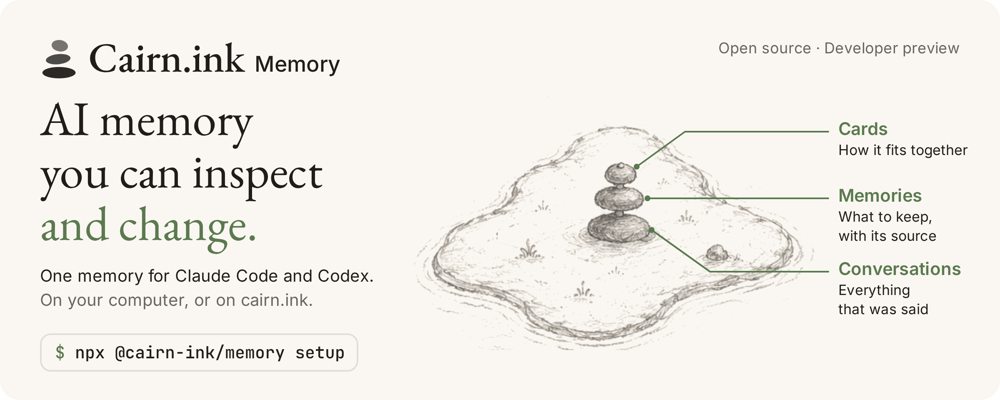
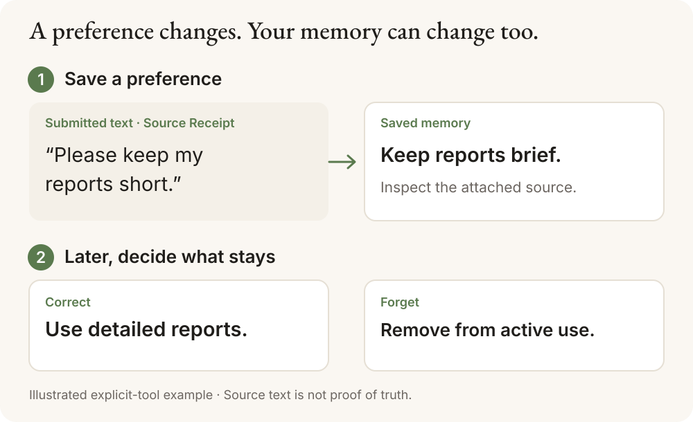

<p align="center">
  <picture>
    <source media="(max-width: 600px)" srcset="docs/images/readme-hero-mobile.png">
    
  </picture>
</p>

<h1 align="center">Cairn.ink Memory</h1>

<p align="center"><strong>給 Claude Code 和 Codex 用的記憶，你可以查看、修改，也可以叫它忘記。</strong></p>

<p align="center">
  <a href="https://github.com/Cairn-ink/cairn-memory/actions/workflows/ci.yml"></a>
  <a href="https://www.npmjs.com/package/@cairn-ink/memory"></a>
  <a href="LICENSE"></a>
  <a href="https://cairn.ink"></a>
</p>

<p align="center">
  <a href="README.md">English</a> · 繁體中文
</p>

Claude Code 和 Codex 開新對話時，常常不知道你之前講過的偏好和專案決定，只好一講
再講。Cairn.ink Memory 讓這兩個工具共用一份記憶。每筆記憶都留著存入時的原文，
哪天記錯了或過時了，你可以看它是怎麼來的，再修改它或叫它忘記。

- **每筆記憶都有來源。** 每筆都留著存入時的原文，要不要相信它，你可以先看過再決定。
- **可以改。** 事情變了就修改，不需要了就叫它忘記。
- **兩個工具共用一份。** Claude Code 和 Codex 讀寫的是同一份記憶。
- **放哪裡由你選。** 放在自己電腦上的資料庫，不用帳號；想在每台電腦都用同一份，
  就放 cairn.ink。

這是開發者預覽版，請先看[目前狀態](#目前狀態)和完整的
[已知限制（英文）](docs/limitations.md)。

## 安裝

```sh
npx @cairn-ink/memory setup
```

需要 Node 22.16 以上，以及 `PATH` 上找得到的 Claude Code 或 Codex。安裝時先問：
記憶要放在哪裡？

| | **本機** | **雲端** |
| --- | --- | --- |
| 帳號 | 不需要 | 需要 [cairn.ink](https://cairn.ink) 帳號，用瀏覽器登入一次 |
| 記憶放在哪 | 這台電腦上的 SQLite 資料庫 | cairn.ink |
| 自動保存什麼 | 你和 Claude Code、Codex 的對話，以明文保存 | 你的對話，由 cairn.ink 整理成記憶 |
| 存一筆記憶 | 你開口，agent 才存 | 自動，也可以請 agent 存 |
| 怎麼找回來 | 你問，agent 才去查 | 每次提問自動帶入相關記憶 |
| 換一台電腦 | 不會同步 | 登入後是同一份記憶 |
| 費用 | 免費 | 見[方案與價格](https://cairn.ink/zh-Hant/pricing) |

想跳過這個問題，直接跑 `npx @cairn-ink/memory setup --local` 或
`npx @cairn-ink/memory setup --cloud`。裝完請重開 Claude Code 和 Codex；
Codex 還要到 `/hooks` 允許 Cairn 的設定。一台電腦一次只能用一種模式，
兩種模式之間不會搬移記憶。

套件名稱是 `@cairn-ink/memory`。npm 和 PyPI 上沒有 scope 的 `cairn-memory`
是別人的專案，跟這裡無關。

## 開始使用

裝好本機模式後，Claude Code 和 Codex 都會多一組記憶工具，來自名為
`cairn-local` 的 server。用平常說話的方式講就可以：

```text
記住：我的報告要簡短。
```

之後開新對話：

```text
你記得我喜歡怎樣的報告嗎？
這筆記憶是怎麼來的？
改一下：我現在需要詳細的報告。
忘記這筆記憶。
```

如果 agent 沒有去用記憶工具，直接點名：「用 cairn-local 的記憶工具」。

本機模式也會在你工作時把對話存下來，之後可以直接問：

```text
上週我們對資料庫搬遷做了什麼決定？
```

已保存對話的搜尋是在背景慢慢補上的，剛剛幾分鐘的內容可能還找不到。



| 你想做的事 | 工具 |
| --- | --- |
| 保存一筆記憶，連同存入時的原文 | `remember_memory` |
| 用關鍵字搜尋記憶和已保存的對話，不需要模型金鑰 | `find_memory_candidates`、`read_memory_context` |
| 讓模型挑出相關的記憶，需要你的 OpenAI 金鑰 | `recall_memory` |
| 查看一筆記憶、它的目前版本和原文 | `inspect_memory` |
| 修改一筆記憶的內容 | `correct_memory` |
| 讓一筆記憶不再被使用 | `forget_memory` |

跟著記憶保存的那段原文叫 **Source Receipt**。它讓你看到保存或修改這筆記憶時
送進來的文字，但不能證明這筆記憶是對的。
[所有工具與參數（英文）](docs/standalone-mcp.md#tools)

## 怎麼運作

Cairn.ink Memory 把 agent 學到的東西分成三層存放，就像一座石堆的三顆石頭。

| 層 | 放什麼 | 本機模式 | 雲端模式 |
| --- | --- | --- | --- |
| **對話** | 講過的內容，以可搜尋的文字保存 | 自動存在你的電腦上 | 送到 cairn.ink |
| **記憶** | 值得留下的偏好、決定和事實，每筆都附 Source Receipt | 你或 agent 開口才存 | 從對話自動整理出來，也可以開口存 |
| **卡片** | 把相關記憶整理在一起的主題頁，連成一張地圖 | 預設不會建立 | 你在 cairn.ink 上瀏覽的地圖 |

在本機模式，查詢時會同時回傳記憶，和它背後那些對話裡附日期的片段，所以答案是
帶著依據一起回來的。

## 雲端模式

雲端模式會自動保存、自動回想，不用你開口。

- **保存。** 登入後，Claude Code 和 Codex 的對話文字會自動保存。送出前會先在
  你的電腦上遮蔽看起來像密碼或金鑰的內容，遮蔽是盡力而為，不保證全部遮到。
- **回想。** 每次提問會送一份遮蔽過、限制長度的副本到 cairn.ink，找到的相關
  記憶會帶進這次提問。
- **暫停。** 不想被記下的對話，開始前跑 `npx @cairn-ink/memory pause`，結束後跑
  `npx @cairn-ink/memory resume`。如果只接了 Claude Code，改在 Claude Code 裡用
  `/cairn-memory:pause` 和 `/cairn-memory:resume`。暫停期間的內容事後不會補存。
- **兩個工具。** 第一次一起設定只要用瀏覽器登入一次。先裝 Claude Code、後加
  Codex，需要用同一個帳號再登入一次。
- **Codex。** 只有安裝器驗證過的 Codex 版本會開啟自動記憶，
  `npx @cairn-ink/memory status` 會顯示你的版本有沒有通過。`codex exec`
  這類自動執行的工作預設不會保存，要另外開啟。

在工作對話上開啟之前，請先讀
[雲端會送出什麼、怎麼控制](https://cairn.ink/zh-Hant/memory/privacy)。
[雲端模式細節（英文）](docs/cloud-mode.md)說明手動安裝外掛、雲端 MCP 端點、
Codex 的規則，以及外掛的隱私約定。

## 你的資料

- **本機。** 你的記憶和已保存的對話放在一個明文的 SQLite 資料庫，預設是
  `~/.cairn-memory/data/memory.sqlite`；旁邊的資料夾 `memory.sqlite.raw-search`
  放搜尋用的索引，同樣是明文。不會傳任何東西給 Cairn，也不需要 Cairn 帳號。
  安裝時會從 npm 下載引擎需要的套件。
- **已保存的對話。** 本機模式會自動把你和 Claude Code、Codex 的對話文字存進
  這個資料庫，上限 200 MB，不呼叫模型，也不需要金鑰。要關掉，跑
  `npx @cairn-ink/memory config --local-capture off`，或安裝時用
  `npx @cairn-ink/memory setup --local --no-capture`。
  `npx @cairn-ink/memory raw list` 會列出已保存的對話，不顯示內容。
  `npx @cairn-ink/memory raw delete <conversation-id>` 會先預覽要刪掉什麼，
  加上 `--yes` 才真的刪除。從那段對話存下來的記憶會留著，要另外叫它忘記。
- **模型金鑰。** 保存、關鍵字搜尋、查看、修改、忘記都不呼叫模型。如果工具啟動
  記憶 server 的環境裡有 `OPENAI_API_KEY`，引擎會自動使用它：在背景替已保存的
  記憶和對話建立語意搜尋用的向量，`recall_memory` 也會送出它挑選的文字。這些
  文字都會送到 OpenAI。沒有金鑰時，不會送任何東西給模型供應商。花費上限和
  關閉語意搜尋的方式，見[預設功能、成本與開關（英文）](docs/defaults.md)。
- **雲端。** 對話文字和提問會在盡力遮蔽後送到 cairn.ink。Claude Code 外掛預設
  會傳不含內容的使用統計，可以關閉。Codex 的登入資訊存在未加密、只有你的
  使用者帳號讀得到的檔案裡。
- **忘記。** 忘記一筆記憶，是讓它不再被使用，同樣的文字也不能再存一次。這不是
  安全抹除：資料庫檔案和備份裡可能還留著那段文字，換個說法的內容也可能被存成
  新的記憶。在本機模式，忘記或修改一筆記憶時，也會把這筆記憶保存時間前後
  30 分鐘內有訊息的對話一起隱藏。這可能藏到無關的對話，也可能漏掉相關的對話，
  要刪掉特定一段對話請用 `raw delete`。
- **解除安裝。** `npx @cairn-ink/memory uninstall --local` 會斷開工具的連接，
  資料會留在硬碟上。解除雲端模式，你在 cairn.ink 上的記憶也會留著。

[本機資料、備份與刪除（英文）](docs/local-from-source.md#local-privacy-and-control) ·
[隱私與威脅模型（英文）](docs/privacy.md) ·
[預設功能、成本與開關（英文）](docs/defaults.md)

## 如果你在跑 agent harness

安裝器會把記憶 server 註冊給這台電腦上所有的 Claude Code 和 Codex 對話。每個對話
各自啟動一份，所以 harness 一次開很多 agent，就會同時有那麼多份記憶 server 開著
同一個資料庫。不想讓 worker 載入它，可以這樣做：

- **Claude Code。** 啟動 worker 時加 `--strict-mcp-config`，只載入你用
  `--mcp-config` 指定的 server。
- **Codex。** 用 `codex exec --ignore-user-config` 啟動 worker，略過註冊了這個
  server 的全域設定。

你自己開的互動對話照常使用記憶。

## 目前狀態

這是開發者預覽版。依賴它之前，請先知道這些限制：

- **保存之後，搜尋要一點時間才跟上。** 本機模式在 Claude Code 或 Codex 開著的
  時候，在背景替新對話建索引：大約 1,000 則訊息要幾分鐘，10,000 則約一小時。
  索引跟上之前，搜尋會標示結果只涵蓋一部分。大約 50,000 則以上的歷史可能永遠
  建不完。
- **本機模式要你開口才會回想。** 本機模式不會自己把記憶帶進提問，你問了，
  agent 才去查。
- **平台。** 本機安裝在 Linux 和 WSL 測試過。macOS 走同一套程式，但還沒測試。
  Windows 原生環境下 `setup --local` 會拒絕執行，請用 WSL，或照
  [PowerShell 原始碼安裝指南（英文）](docs/windows-install.md)操作。
- **語意回想需要金鑰。** 沒有 OpenAI 金鑰時，`recall_memory` 會回報
  `model_not_configured`，關鍵字搜尋照常可用。完全在本機跑模型的路徑還沒有驗證。
- **抽取品質。** 引擎預設用模型抽取記憶的品質，還沒通過我們自己訂的來源支持
  標準。證據和保留下來的失敗案例都在[已知限制（英文）](docs/limitations.md)。

[Roadmap](ROADMAP.md) · [Changelog](CHANGELOG.md) ·
[每項主張的依據（英文）](docs/promotion-claims.md)

想追蹤新版本，可以幫這個 repo 按星。

## Cairn.ink Memory 和 Cairn.ink

**Cairn.ink Memory** 是這個 repo 裡的開源記憶層。**[Cairn.ink](https://cairn.ink)**
是雲端產品，一張人和 AI 工具共用的記憶地圖，用來整理、審閱和分享知識。
雲端模式把 Claude Code 和 Codex 接到你的 Cairn.ink 帳號，本機模式完全不會連到它。

## 這個 repo 裡有什麼

- 安裝器 `@cairn-ink/memory`，以及 Claude Code 外掛和它的 marketplace 設定；
- 本機的 SQLite 記憶引擎，包含來源原文、修改、忘記與搜尋，還有一個精簡的
  本機 MCP server；
- 在本機過濾對話、遮蔽敏感內容、推導專案識別的程式；
- 公開的 HTTP 與 MCP 通訊規格，附 JSON Schema；
- 選用的 OpenAI adapter；
- 相容性測試與自架說明。

Cairn.ink 雲端的抽取服務、使用者資料庫、登入、計費、濫用防護與營運，放在另一個
不公開的 repo。請見[架構（英文）](docs/architecture.md)和
[自架（英文）](docs/self-hosting.md)。

## 更多文件

除了安裝器說明是中英對照，以下文件目前都是英文。

| 你想做的事 | 文件 |
| --- | --- |
| 看所有安裝選項、切換模式、處理卡住的安裝 | [安裝器說明](packages/setup/README.md) |
| 手動連接雲端，或讀它的規則與隱私約定 | [雲端模式細節](docs/cloud-mode.md) |
| 從原始碼建置，或手動設定 client | [從原始碼安裝本機預覽版](docs/local-from-source.md)、[Windows 指南](docs/windows-install.md) |
| 安裝前先看它怎麼跑 | [36 秒操作錄影（MP4）](docs/promotion/demo/cairn-memory-preview.mp4) |
| 在引擎上開發 | [架構](docs/architecture.md)、[MCP 工具](docs/standalone-mcp.md) |
| 搭配 Hermes 使用 | [Hermes 設定](docs/hermes-first-use.md) |
| 回報安全問題 | [SECURITY.md](SECURITY.md) |

## 給 AI agent

如果使用者請你安裝 Cairn.ink Memory：

- 從 npm 安裝 `@cairn-ink/memory`，原始碼在 `github.com/Cairn-ink/cairn-memory`。
  不要安裝 npm 或 PyPI 上沒有 scope 的 `cairn-memory`。
- 執行任何指令前，先請使用者選本機或雲端。雲端會把對話文字上傳到 cairn.ink，
  而且要由使用者自己登入。本機預設會把對話文字存在這台電腦上，使用者不想要
  的話，加上 `--no-capture`。
- 在非互動的 shell 裡，請跑 `npx @cairn-ink/memory setup --local` 或
  `npx @cairn-ink/memory setup --cloud`。第一次安裝時，非互動執行如果沒有加模式
  旗標，不會寫入任何設定。
- 安裝完成後，請使用者重開 Claude Code 和 Codex。

## 開發

外掛的執行環境與測試不依賴其他套件，需要 Node.js 20 以上。只有維護者會用到的
Claude 外掛驗證需要 Node.js 22，獨立放在 `tools/plugin-validation`，不會跟著
外掛一起安裝。

```bash
npm test
npm run test:setup
npm run validate
npm ci --prefix tools/plugin-validation
npm run validate --prefix tools/plugin-validation
```

本機儲存引擎需要 Node >=22.16，不用另外安裝相依套件：

```bash
npm run test:core
npm run demo:store
```

歡迎貢獻，請先讀 [CONTRIBUTING.md](CONTRIBUTING.md) 和
[docs/protocol.md](docs/protocol.md) 裡的隱私規則。程式碼以
[Apache-2.0](LICENSE) 授權。
